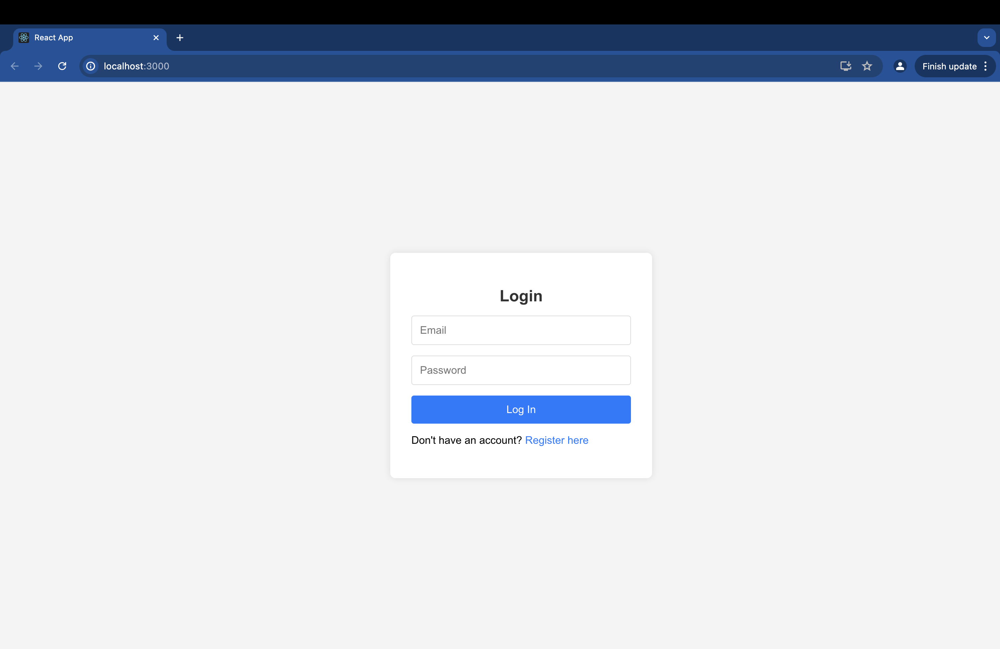
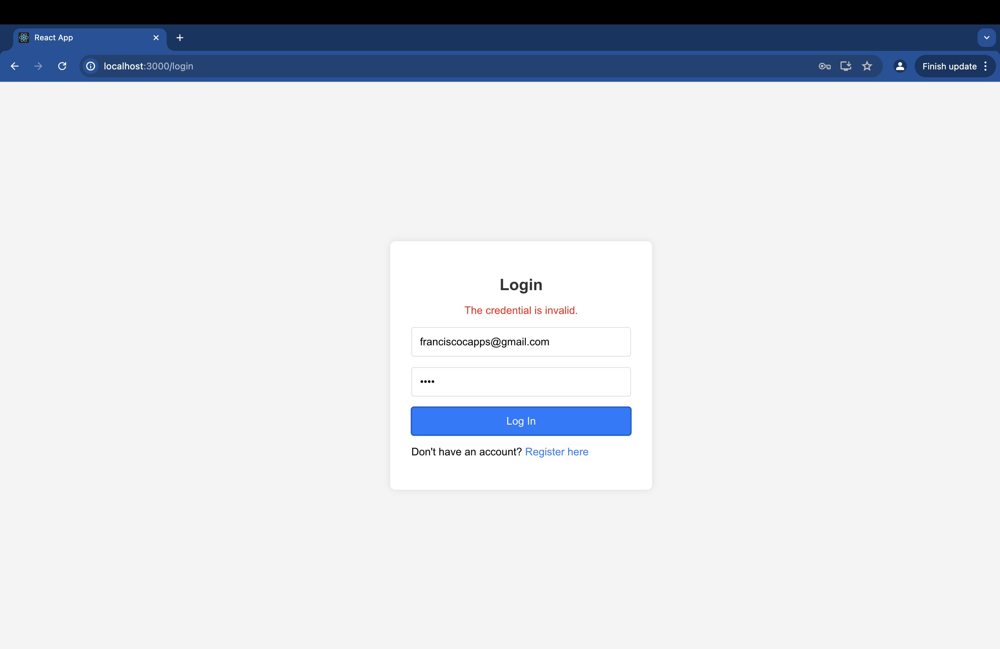
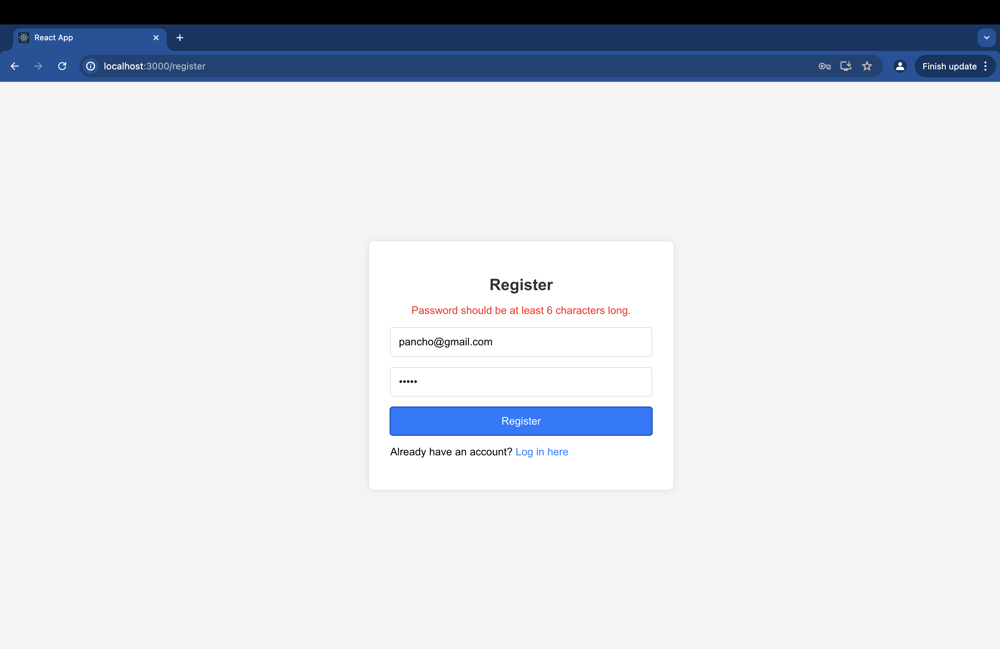
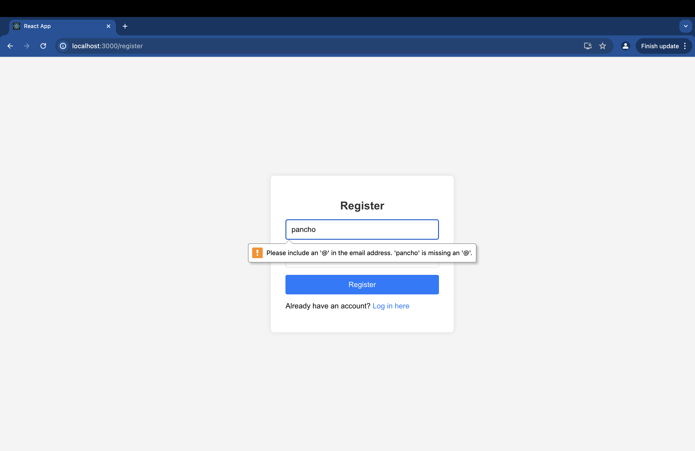
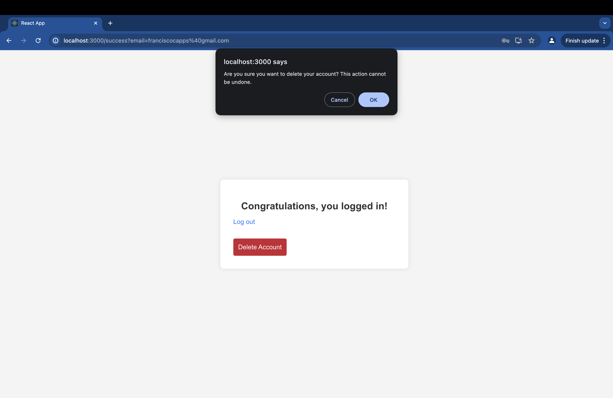
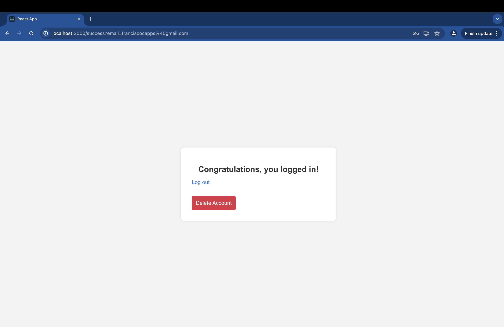

# Website Functionality Overview

## Login Page
### Overview
The login page is the first interaction users have with the website. Users are prompted to enter their email and password to access their account.

### Functionality
1. **Email and Password Entry:**
   - Users are required to enter a valid email and password to log in.
   - If the credentials are not valid or the email is not registered, the login attempt will fail, and an error message will be displayed.

2. **Register Account Option:**
   - Below the login form, there is a link for users to register a new account if they do not already have one.

### Screenshots

## Register Page
### Overview
The register page allows new users to create an account by providing an email and a password.

### Functionality
1. **Email and Password Requirements:**
   - Users must enter an email and a password that is at least 6 characters long.
   - The email must include an '@' symbol. If the email does not include '@', users cannot proceed with the registration.

2. **Back to Login:**
   - There is a "Back to Login" link at the bottom of the register page, allowing users to return to the login page.

### Screenshots

## Successful Login
### Overview
Once users successfully log in, they are greeted with a congratulatory message and additional account management options.

### Functionality
1. **Congratulations Message:**
   - Upon successful login, users see a message congratulating them on their successful login.

2. **Delete Account Option:**
   - Below the congratulatory message, there is a button to delete the account.
   - Clicking the delete button prompts a confirmation dialog asking if the user really wants to delete the account.
     - If the user clicks "Cancel," the deletion process is aborted.
     - If the user clicks "OK," the account is permanently deleted.

### Screenshots

## Summary
This website provides a straightforward user experience with essential account management features, including secure login, registration, and account deletion functionalities.